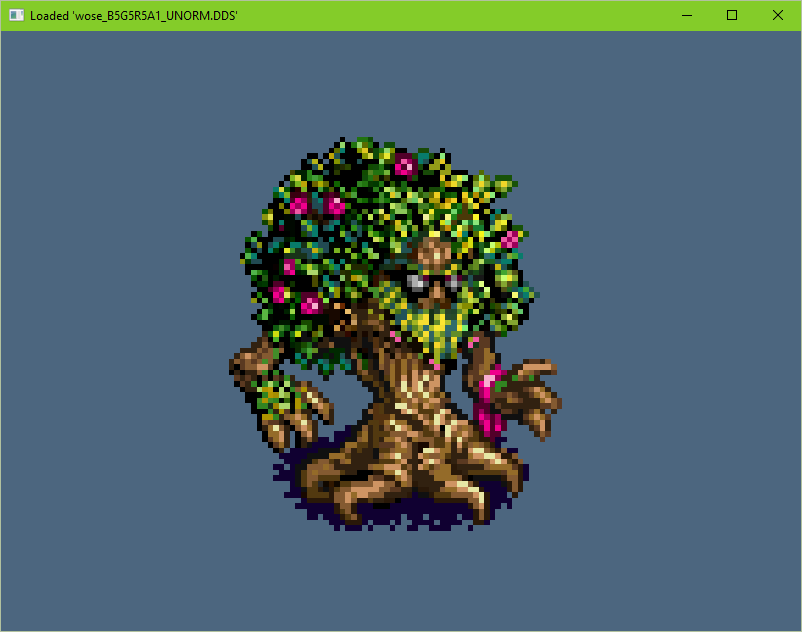

# Dades #

Simple managed reader for a DDS format, created with both DirectX and OpenGL in mind.

## What does it do? ##

It allows you to read almost any DirectDraw Surface file without XNA and using managed code only.
It was designed as a quick and straightforward way to read most of DDS files, except packed formats like Y410 or NV12.
There is also an OpenGL example which shows what to do with read pixel data.

## Are there any existing solutions for DDS reading? ##

- OpenTK example DDS loader cannot deal with partial cubemaps and formats other than DXT1-5.
- DevIL .NET Wrapper can only deal with flat textures and doesn't parallelize well.
- DDSLib supports a fair amount of formats, but requires XNA.

There could be a better DDS loader in a C++ world, if you are into wrappers and interop.

## Pros: ##

- No need for XNA or unmanaged code.
- Supports all texture types — regular flat textures, volume textures and cube-maps with 1–6 faces — and their arrays.
- Supports **a lot** of formats.
- Deals with DDS reading mostly, so its pretty easy to learn and use, just write 1 line of code to read a DDS file.
- Can do optional vertical flipping for OpenGL convenience, in case you don't want to flip UVs for some reason.
- I prepared a short but comprehensive example of loading all texture types to OpenGL via OpenTK.

## Cons: ##

- Cannot write DDS files.
- Cannot load DDS data into a standard GDI+ Bitmap class, but it should be straightforward to implement, at least for most formats. 
Check *DadesOglExample/PixelFormatInfo.cs* to see how DX formats correspond to usual pixel formats.
- I was too lazy to do proper TDD; also no guarantees for big-endian systems, needs testing.

## Usage ##

Simply create a DdsFileData and pass it a .dds file or a stream:

    // If you intend to pass read data into OpenGL texture, you probably want 'doVerticalFlip' set to 'true'.
    var dds = new DdsFileData("some_texture_filename.dds", doVerticalFlip=true);

then look at its properties:

    foreach (var texture in dds.Textures)  // Usually there is just one texture here, though.
    {
        foreach (var surface in texture.Surfaces)   // Each texture can be composed of several surfaces, usually mip-maps.
        {
            // Do whatever you want with a surface here.
            // There are surface type, level, width, height and bytes array available to you.
        }
    }

For a more complete example showcasing OpenGL loading take a look at the *DadesOglExample/SimpleTexture.cs*.

# Credits #

Thanks to [Racer](http://www.racer.nl/tech/dds.htm) (a free car simulator project) for BC1-3 block flipping code idea :)

## Where all of the example textures came from ##

### Flat textures ###

All wose_*.dss were generated with **texconv** tool from [DirectXTex project](http://directxtex.codeplex.com/)
These images use a sprite of *Wose* from the great game "[Battle for Wesnoth](http://http://wesnoth.org/)". Give it a try sometimes.
Note that some of the generated images are marked as *empty*: they contain a correct header for their format, but no pixel data.

### Cube-maps ###

Cubemaps were generated with [AMD's cubemap generator](http://code.google.com/p/cubemapgen/).
Image data came as a result of a Google image search without any copyright info, I have no idea if it belongs to anyone or not.

### Volume textures ###

Noise3D.dds is a standard noise texture from DirectX SDK.